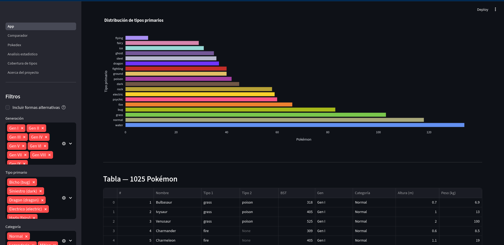
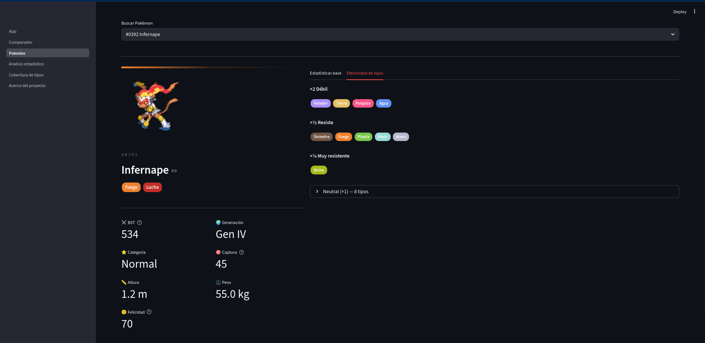
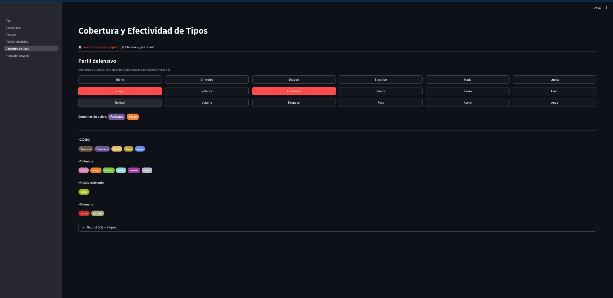

# pokemon-data


Pipeline ETL que descarga todos los datos de [PokéAPI](https://pokeapi.co) y los carga en
SQLite. Incluye un **dashboard Streamlit multipágina** interactivo, notebooks de análisis
exploratorio con Plotly y un workflow de **machine learning** (clustering K-means, en desarrollo).

> **Demo en vivo:** [dashboard](https://code-diego-pokemon-data.streamlit.app/).

## Screenshots

| Vista general | Pokédex | Cobertura de tipos |
|:---:|:---:|:---:|
|  |  |  |


## Página principal (Dashboard)

```bash
# 1ra vez: instalar, descargar y construir la base de datos
pip install -r requirements.txt
python scripts/fetch.py        # ~10 min — descarga de PokéAPI
python scripts/build_db.py     # construye data/pokemon.db

# Iniciar el dashboard
streamlit run dashboard/App.py
```

> **Demo con datos de muestra:** si no quieres ejecutar el ETL completo, genera la BD reducida
> (gen I–III, ~150 Pokémon) con `python scripts/build_sample_db.py`. El dashboard la detecta
> automáticamente y muestra un banner informativo.

Se abre en `http://localhost:8501`. Todas las páginas están en el menú lateral:

| Página | Descripción |
|--------|-------------|
| **Vista general** | KPIs, filtros por gen/tipo/categoría, distribución de tipos y tabla filtrable |
| **Comparador** | Radar de stats y BST para 2–6 Pokémon lado a lado |
| **Pokédex** | Ficha individual: sprite, stats, debilidades y métricas de juego |
| **Análisis estadístico** | Correlaciones, histogramas, Mann-Whitney U y BST por tipo |
| **Cobertura de tipos** | Calculadora defensiva/ofensiva de cobertura de tipos |
| **Acerca del proyecto** | Stack técnico, pipeline y volumen de datos |


## Estructura

```
pokemon-data/
├── scripts/
│   ├── fetch.py              # descarga datos de PokéAPI → data/raw/
│   ├── build_db.py           # construye pokemon.db (SQLite, 9 tablas)
│   ├── build_sample_db.py    # genera data/sample.db (gen I–III, para deploy)
│   └── build_nosql.py        # construye pokemon_docs.json + carga MongoDB
├── notebooks/
│   ├── relational.ipynb      # análisis exploratorio SQLite · Plotly
│   ├── clustering.ipynb      # clustering K-means + PCA ⚠️ en desarrollo
│   └── nosql.ipynb           # consultas documentales en MongoDB
├── dashboard/
│   ├── App.py                # página principal (filtros, KPIs, gráficas)
│   ├── data.py               # módulo compartido: carga cacheada, type-chart, helpers
│   └── pages/
│       ├── 1_Comparador.py           # comparador de stats para 2–6 Pokémon
│       ├── 2_Pokedex.py              # ficha individual con debilidades
│       ├── 3_Analisis_estadistico.py # correlaciones, Mann-Whitney, BST por tipo
│       ├── 4_Cobertura_de_tipos.py   # calculadora defensiva/ofensiva
│       └── 5_Acerca_del_proyecto.py  # stack técnico y pipeline
├── docs/
│   ├── screenshots/          # capturas del dashboard (ver guía en su README.md)
│   └── MONGO_GUIDE.md        # guía de instalación de MongoDB
├── requirements.txt
├── requirements-nosql.txt    # pymongo (opcional, solo para MongoDB)
└── data/
    ├── sample.db             # ✅ en git — BD demo gen I–III (build_sample_db.py)
    ├── raw/                  # ❌ gitignore — caché JSON (fetch.py)
    │   ├── pokemon/          # 1,350 archivos
    │   ├── species/          # 1,025 archivos
    │   ├── types/            #    21 archivos
    │   ├── abilities/        #   371 archivos
    │   └── moves/            #   937 archivos
    ├── pokemon.db            # ❌ gitignore — BD completa (build_db.py)
    └── pokemon_docs.json     # ❌ gitignore — respaldo MongoDB
```

## Requisitos

```bash
pip install -r requirements.txt
```

| Paquete        | Uso |
|----------------|-----|
| `aiohttp`      | Descargas asíncronas en `fetch.py` |
| `tqdm`         | Barra de progreso en `fetch.py` |
| `pandas`       | Análisis de datos en notebooks y dashboard |
| `numpy`        | Cálculos numéricos |
| `plotly`       | Gráficas interactivas (hover, zoom) en notebooks y dashboard |
| `streamlit`    | Dashboard multipágina |
| `scikit-learn` | K-means, PCA, StandardScaler — clustering ML (incluye scipy) |

MongoDB opcional → `pip install -r requirements-nosql.txt`

---

## Notebooks de análisis

```bash
jupyter notebook notebooks/relational.ipynb
jupyter notebook notebooks/clustering.ipynb
```

### `relational.ipynb` — análisis exploratorio (SQLite · Plotly)

Requiere `data/pokemon.db` (`build_db.py`).

| Sección | Contenido |
|---------|-----------|
| 0 | Explorador de tablas — esquema, filas, nulos, distribuciones |
| 1 | Vista general: 1 025 formas base (excluye 325 formas alternativas) |
| 2 | Distribución de tipos primarios |
| 3 | Peso y altura |
| 4 | Stats base (BST) por tipo y generación |
| 5 | Legendarios, míticos y normales |
| 6 | Efectividad de tipos — matriz 18×18 con etiquetas coloreadas |
| 7 | Combinaciones de tipos — ranking de pares + matriz simétrica |
| 8 | Consultas SQL personalizadas |

### `clustering.ipynb` — Machine Learning (scikit-learn) ⚠️ en desarrollo

> **⚠️ En desarrollo** — El modelo K-means (k=5) y la visualización PCA están implementados
> y validados. La integración con el dashboard es trabajo pendiente.

Requiere `data/pokemon.db` (`build_db.py`).

| Sección | Contenido |
|---------|-----------|
| 1 | Carga de datos (SQLite) |
| 2 | EDA — distribución de los 6 stats base |
| 3 | Estandarización con `StandardScaler` |
| 4 | Elección de k — curva de codo + silhouette score |
| 5 | Ajuste K-means final (k=5) |
| 6 | Visualización PCA 2D (hover interactivo) |
| 7 | Interpretación de arquetipos — heatmap de perfiles |
| 8 | Validación — ¿los legendarios caen en el mismo cluster? |
| 9 | Conclusiones |

### Machine Learning

```
datos (SQLite) → StandardScaler → elección de k (codo + silhouette)
  → KMeans(k=5) → PCA 2D → arquetipos → validación con legendarios
```

Los clusters identifican arquetipos estadísticos sin etiquetas previas (tanques, velocistas,
atacantes especiales, Pokémon poderosos, débiles de inicio). La validación comprueba que los
legendarios se concentran en el cluster de BST alto, aunque el modelo no recibió esa información.

---

## MongoDB (backend NoSQL)

El backend MongoDB es **opcional** — el dashboard y los notebooks de análisis solo necesitan SQLite.

### Configuración

```bash
podman start mongodb            # arranca el contenedor (ver docs/MONGO_GUIDE.md)
python scripts/build_nosql.py   # genera data/pokemon_docs.json + carga MongoDB
```

> **¿Aún no tienes MongoDB?** Ver **[docs/MONGO_GUIDE.md](docs/MONGO_GUIDE.md)**.

### `nosql.ipynb` — consultas documentales

Requiere MongoDB corriendo y la colección cargada (`build_nosql.py`).

| Sección | Contenido |
|---------|-----------|
| 1 | Conexión a MongoDB |
| 2 | Estructura de un documento |
| 3 | Búsqueda por nombre o ID |
| 4 | Legendarios y míticos |
| 5 | Aggregation Pipeline — BST promedio por tipo |
| 6 | Búsqueda por movimiento (`$elemMatch`) |
| 7 | Filtro combinado por tipo y BST mínimo |

### ¿Cuándo usar cada backend?

|  | SQLite | MongoDB |
|--|--------|---------|
| Modelo | 9 tablas relacionadas | 1 documento por Pokémon |
| Consultar un Pokémon | JOIN de 5+ tablas | `find_one({"name": "..."})` |
| Filtros en arrays | Subconsulta + JOIN | `$elemMatch` directo |
| Ideal para | Estadísticas, ML, análisis exploratorio | APIs, recuperación rápida, esquema flexible |

### Variable de entorno

Si MongoDB no corre en `localhost:27017`:

```bash
MONGO_URI="mongodb://mi-servidor:27017" python scripts/build_nosql.py
```

---

## Posibles mejoras

- **Evoluciones** — añadir `evolution-chain` de PokéAPI para analizar cadenas evolutivas.
- **Tests** — pruebas unitarias para los loaders con una muestra pequeña de JSON fijos.
- **CI/CD** — GitHub Actions para ejecutar tests y lint en cada push.
- **Despliegue** — publicar el dashboard en Streamlit Community Cloud con una BD de muestra versionada.
- **Clusters en el dashboard** *(pendiente activo)* — página interactiva de K-means; modelo ya validado en el notebook, integración con Streamlit pendiente.
- **Actualización incremental** — `build_db.py` reconstruye la BD completa; se puede hacer incremental.
